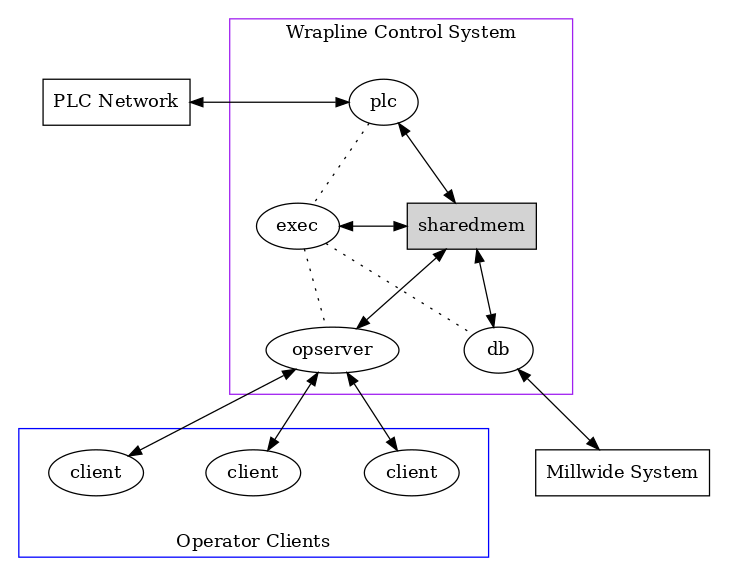
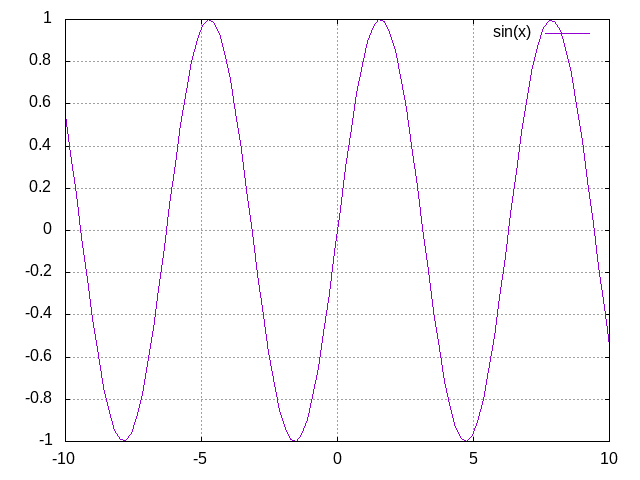

# Created 2019-05-26 Sun 18:41
#+OPTIONS: num:t toc:1 H:4
#+TITLE: Org-mode exporter template for testing
#+AUTHOR: stardiviner

* Comment

* Property

* Paragraph

** horizontal rules
AAAAAAAAAAAAAA

-----

BBBBBBBBBBBBB

* Formatting text

** bold & italic
- *bold text*
- /italic text/

** monospace, superscript and subscript
- monospaced typewriter font for ~inline code~
- monospaced typewriter font for =verbatim text=
- +deleted text+ (vs. _inserted text_)
- text with super^{script}, such as 2^{10}
- text with sub_{script}, such as H_{2}O

** Inline code
=inline code=

If you have ~\equal~, ~\quot~ or ~\rsquo~ in code which you want to surround by ~=code=~.

* Smart punctuation
If the XXX option is specified, Org mode will produce typographically correct
output, converting straight quotes to curly quotes, ~---~ to em-dashes, ~--~ to
en-dashes, and ~...~ to ellipses.

* Plain lists

** un-ordered lists
- one
- two
- three

- [ ] one
- [ ] two

- one :: 1
- two :: 2

- Item with some lengthy text wrapping hopefully across several lines. We add
  a few words to really show the line wrapping.
- Bullet.
  - Bullet.
    - Bullet.

** ordered lists
1. Arabic (decimal) numbered list item. We add a few words to show the line
   wrapping.
   1. Upper case alpha (letter) numbered list item.
      1. Lower alpha.
      2. Lower alpha.
   2. Upper alpha.
2. Number.

*** ordered list with jumping numbers
1. line one
2. [@2] We start with point number 2.
3. Automatically numbered item.

** checklists
- [X] Checked.
- [-] Half-checked.
- [ ] Not checked.
- Normal list item.

** definition list
- First term to define :: 
     Definition of the first term. We add a few words to show the line wrapping,
     to see what happens when you have long lines.

- Second term :: 
     Explication of the second term with *inline markup*.

     In many paragraphs.

** separating lists
- apples
- oranges
- bananas

- carrots
- tomatoes
- celery

* Tables
Tables are one of the most refined areas of the Org mode syntax. They are very
easy to create and to read.

** simple table
| column 1                | column 2                |
|-------------------------+-------------------------|
| Cell in column 1, row 1 | Cell in column 2, row 1 |
| Cell in column 1, row 2 | Cell in column 2, row 2 |

** Table with aligned cells
| 1            | 2            | 3            |
| Right        | Center       | Left         |
|--------------+--------------+--------------|
| xxxxxxxxxxxx | xxxxxxxxxxxx | xxxxxxxxxxxx |

** Header row
| Name of column 1 | Name of column 2 | Name of column 3 |
|------------------+------------------+------------------|
| Top left         | Top middle       |                  |
|                  |                  | Right            |
| Bottom left      | Bottom middle    |                  |

* Hyperlinks

** Internal links

*** radio target link
Here is a <<<radio_target_link>>>

-----

Reference previous a radio_target_link.

**** <<<foo>>>
About foo. What is foo?

**** <<<bar>>>
bar is developed based on foo.

*** TODO coderef
#+begin_src emacs-lisp -n -r
(save-excursion                  (ref:sc)
   (goto-char (point-min)))      (ref:jump)
#+end_src

In line [[(sc)]] we remember the current position. [[(jump)][Line (jump)]] jumps to point-min.

** External links

* Drawers

** test drawer

* Dynamic blocks
#+begin: clocktable :maxlevel 2 :scope subtree
#+caption: Clock summary at [2017-02-24 Fri 09:37]
| Headline     | Time   |   |
|--------------+--------+---|
| *Total time* | *0:00* |   |
#+end:

* ASCII export

* Inline Images
#+name: fig:bldg-1-5-seq
#+caption: This is an image

** Image attributes and values

* Footnote
A footnote is defined in a paragraph that is started by a footnote marker in
square brackets in column 0, no indentation allowed. The footnote reference is
simply the marker in square brackets, inside text. For example:

The org homepage [fn:1] now looks a lot better than it used to.

[fn:1] The link is: http://orgmode.org

* Entity
1 + 1 \equal 2

Like \EUR with

* LaTeX

** Inline LaTeX
This is inline latex \[ 1 + 2 = 3 \]. and $3 * 3 = 9$ .

** LaTeX block
\begin{equation} \label{sqrt equation}
y = \sqrt{r^2 - x^2}
\end{equation}

** a more complex latex block
\begin{minted}[mathescape,
               linenos,
               numbersep=5pt,
               gobble=2,
               frame=lines,
               framesep=2mm]{csharp}
string title = "This is a Unicode π in the sky"
/*
Defined as $\pi=\lim_{n\to\infty}\frac{P_n}{d}$ where $P$ is the perimeter
of an $n$-sided regular polygon circumscribing a
circle of diameter $d$.
*/
const double pi = 3.1415926535
\end{minted}

* Blocks

** Quote block

#+begin_quote
This is a quote block.
#+end_quote

** LaTeX export block

** ASCII export block

#+begin_src shell :results output :wrap export ascii
tree .
#+end_src

** HTML export block

* src blocks

** syntax highlighting
#+begin_src emacs-lisp
(defun hello (name)
  (print (format "Hello, %s" name)))

(hello "stardiviner")
#+end_src

#+results[<2018-03-20 16:55:50> a7374e16f518f05926eef97e5ab37b1e7bf72167]: 
: Hello, stardiviner

** escape math formulas in src block
#+begin_src emacs-lisp
;; Defined as $\pi=\lim_{n\to\infty}\frac{P_n}{d}$ where $P$ is the perimeter
;; of an $n$-sided regular polygon circumscribing a
;; circle of diameter $d$.
(prin1 "hello, world!")
#+end_src

** highlight code tags
#+begin_src emacs-lisp
;;; TODO does this code tag highlighted?
;;; TODO: what about this one?
;;; XXX
;;; BUG
;;; NOTE
(prin1 "yes")
#+end_src

** src block with inline image result
#+begin_src gnuplot
set grid

plot sin(x)
#+end_src

#+results[<2018-04-03 21:54:38> ed8d07c969050af99dda8a1e782e7aa404b80da0]: 

* 中文测试
这是中文段落

* Reference to previous pages links

** radio target link reference
foo

** coderef
In line [[(sc)]] we remember the current position. [[(jump)][Line (jump)]] jumps to point-min.

* Footnotes
