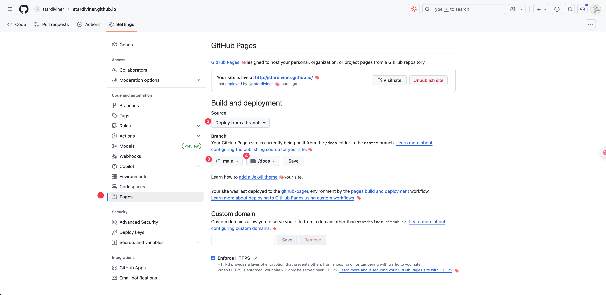

# org-publish workflow

**NOTICE**: GitHub Pages services build and deploy from "main" branch and "docs/" directory.

1.  git switch to the branch "main" with `git switch main`.
2.  modify my website blog `.org` files.
3.  Emacs **org-publish** will publish the changes with Emacs *command* `[M-x org-publish RET <component> RET]`.
    **NOTE**: [org-publish] you can only publish specify component instead of the whole website project.
4.  git push the branch "`main`" **source code file changes** to the remote repository with:
    1.  "`git add .`" (exclude **org-publish exported destination dir** "`docs/`")
    2.  `git commit -m "<your commit message>"`
    3.  `git push origin main`
5.  git push the branch "`main`" **destination file changes** in "`docs/`" to remote repository with:
    1.  "`git add docs`"
    2.  `git commit -m "<your commit message>"`
    3.  `git push origin main`
6.  verify that the changes are live on the website at [my blog](<https://stardiviner.github.io/>).
